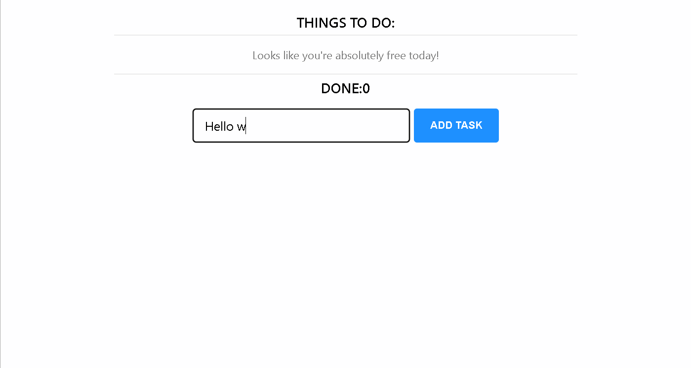

# To Do List React App




## Description

The ToDo list is a basic React application channeling localStoage & Context capabilities.  
Task given out by Matrix company.

## Getting Started

### Dependencies

* Node.js v14.17.5
* Windows 10

### Installing

* Clone this repository locally
* run:
```
npm install
```

### Executing program

* open cmd in front folder and run 
```npm start```

## Note

The React.js app is saving the current session tasks to the localStorage browser
